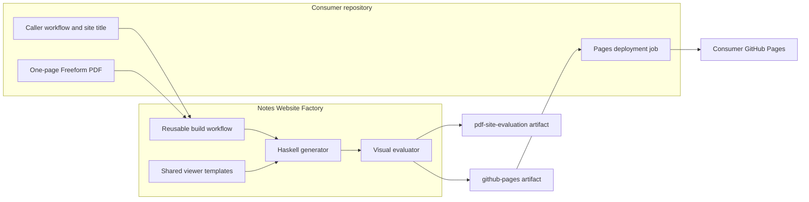
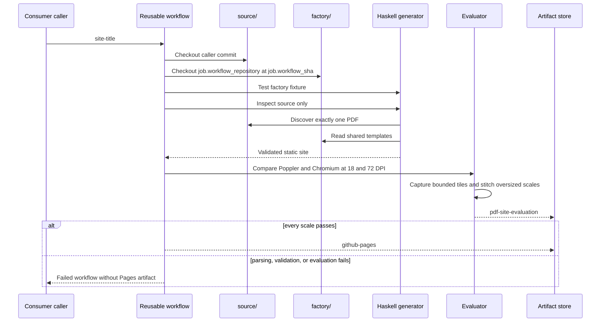
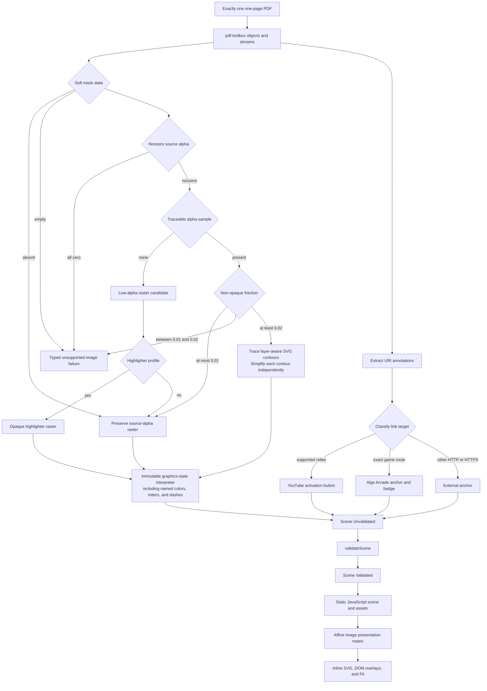

# Architecture

## System Context

The consumer controls content identity and deployment authority. The factory controls every transformation from PDF objects to a validated browser product. The reusable workflow has only `contents: read`; it cannot deploy or request an OpenID Connect token.

## Checkout and Build Sequence

Separate checkout and output roots prevent a factory fixture from contaminating consumer discovery. `job.workflow_sha` prevents a workflow loaded from one commit from independently checking out different generator code, including when callers use `@main`.

## Production Data Flow

The deployed product receives only the validated scene and its extracted assets. Source PDFs and evaluation images stay in build space. The [support profile](/pdf-investigation.md) owns parsing compatibility and classification details; accepted BDRs own observable output behavior.

[BDR 0017](/bdr/0017-preserve-local-traced-detail.md) owns layer-aware contour interpolation and local simplification; `Factory.Vectorize` retains that responsibility without changing the scene schema or browser renderer.

## Module Boundaries

| Module | Responsibility | Effects |
| --- | --- | --- |
| `Factory.Domain` | Coordinates, matrices, color spaces, paint styles, nodes, typed link targets, assets, titles, validation phases, and errors | None |
| `Factory.Geometry` | PDF-to-board transformations and affine matrix operations | None |
| `Factory.Interpreter` | PDF operator state machine and scene-node emission | None |
| `Factory.Vectorize` | Image classification, highlighter opacity profiling, quantization, contour tracing, and simplification | None |
| `Factory.Pdf` | PDF objects, streams, resources, annotations, structural URL classification, and raster materialization | File input and asset output |
| `Factory.Site` | Scene validation and deterministic site emission | Template and site output |
| `Factory.Evaluation` | Poppler/Chromium execution, bounded capture planning, image stitching, metrics, and reports | Processes and report output |
| `Factory.Pipeline` | CLI dispatch, discovery, protected paths, staging, and promotion | Filesystem orchestration |
| `site/runtime.js` | Shared affine rendering, evaluation-tile offsets, typed link activation, game affordances, and desktop/mobile interaction behavior | Browser DOM |
| `build-pdf-site.yml` | Isolated checkouts, toolchain, evaluation, and artifact upload | GitHub Actions |

## Safety Boundaries

1. `discoverSinglePdf` scans only the consumer source root and requires one non-symlink PDF with one page.
2. The parser and `validateScene` reject unsupported source structures, invalid scene values, and full-board raster output.
3. Removable paths are canonicalized, reject symlink targets and unresolved symlink parents, and cannot overlap protected inputs or independently owned outputs.
4. Output is staged in `DIST.building`, promoted through `DIST.previous`, and checked for product files, relative references, no PDF, and no Canvas fallback.
5. Evaluation inputs remain removable build artifacts; process failures abort the build.
6. The Pages artifact is uploaded only after parsing, validation, browser readiness, and both visual scales pass.
7. Link classification, highlighter opacity, and tiled evaluation policies are specified by the linked ADRs and BDRs below.

## Determinism and Compatibility

- PDF resources, classification, contours, and generated JSON remain deterministically ordered.
- The dependency solver, GHC, Cabal, and third-party actions are pinned.
- Poppler and Chrome revisions can change antialiasing, so fixed tolerances replace exact pixel equality.
- Browser evaluation tiles depend only on output dimensions and fixed `8192`-pixel horizontal and `4096`-pixel vertical boundaries; tile files are removed after stitching.
- `site-title`, `github-pages`, `pdf-site-evaluation`, and generated filenames are public contracts.
- A moving `main` reference intentionally updates consumers on their next run; factory CI exercises the actual reusable workflow before merge.

[ADR 0001](/adr/0001-vector-first-mixed-rendering.md) owns mixed rendering. [ADR 0002](/adr/0002-separate-factory-and-consumers.md) owns repository boundaries. [ADR 0003](/adr/0003-build-artifacts-with-a-reusable-workflow.md) owns workflow and deployment responsibilities. [ADR 0004](/adr/0004-linked-game-cards.md) owns measured mask and game-link trust boundaries. [ADR 0006](/adr/0006-tile-oversized-browser-evaluations.md) owns bounded evaluation capture, and [ADR 0009](/adr/0009-opaque-highlighter-strokes.md) owns the low-alpha highlighter exception. [BDR 0002](/bdr/0002-reusable-workflow-build-contract.md), [BDR 0006](/bdr/0006-expanded-freeform-graphics-output.md), [BDR 0007](/bdr/0007-tiled-visual-evaluation.md), [BDR 0008](/bdr/0008-fixed-light-viewer.md), [BDR 0011](/bdr/0011-opaque-highlighter-output.md), and [BDR 0013](/bdr/0013-remove-topic-navigation.md) own current observable behavior.
