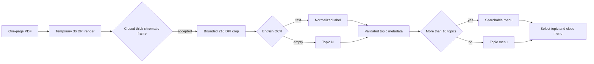

# Searchable Topic Menu

## Behavior Flow

## Description

The build detects geometry from visible page composition but limits OCR to accepted interiors. In normal browser mode, one circular control opens a compact topic menu beside the circular `Fit` control. The browser consumes only labels and bounds; it never receives the PDF or temporary rasters.

## Scenarios

1. Given composited thick chromatic frames, when detection runs, then each closed frame becomes one candidate independent of hue and expected count.
2. Given candidates in overlapping visual rows, when ordering runs, then rows are top-to-bottom and members are left-to-right.
3. Given accepted candidates, when OCR runs, then each receives normalized text or `Topic N`; tool failure or timeout aborts the build.
4. Given topics in normal mode, when the page is ready, then adjacent circular controls contain `Topics` and `Fit`, and the topic menu is closed.
5. Given 10 or fewer topics, when the topic menu opens, then no search field is present.
6. Given at least 11 topics, when the topic menu opens and the reader enters a query, then labels are filtered case-insensitively and an empty result is reported.
7. Given topic selection, when motion is allowed, then the menu closes and context animates for about 450 milliseconds; direct interaction can cancel it and reduced motion applies immediately.
8. Given no topics, when normal mode loads, then only `Fit` is visible.
9. Given evaluation mode, when Chromium captures the board, then controls and topic chrome are hidden.

## Test Design

| Scenario | Instrument | Proof |
| --- | --- | --- |
| 1 | Synthetic frame unit test and 12-target consumer inspection | Detection follows visible geometry without count policy. |
| 2 | Pure ordering unit test | Visual rows have deterministic reading order. |
| 3 | Fallback unit test, real build, and workflow gate | Every candidate is labeled or the build fails. |
| 4, 5, 6, 8, 9 | Normal, many-topic, empty, evaluation, and readiness Chromium DOM tests | Controls, initial menu state, and conditional search match each mode. |
| 7 | Desktop/mobile keyboard, pointer, and reduced-motion inspection | Navigation remains accessible and the menu closes after selection. |

# References

1. [Current requirements](/prd/0009-searchable-topic-menu.md)
2. [Composited detection decision](/adr/0008-composited-topic-detection.md)
3. [Superseded behavior](/bdr/0010-composited-topic-index-navigation.md)
4. [Implementation issue](/issues/0008-add-ocr-topic-navigation.md)
