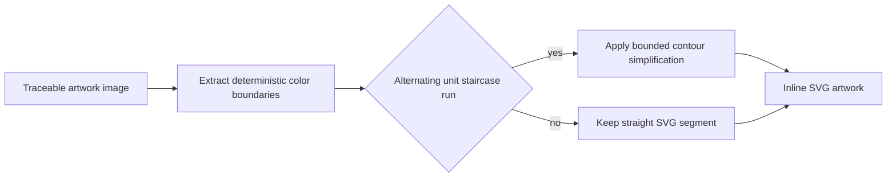

# Smooth Traced SVG Artwork

## Context

The target consumer's Freeform PDF contains artwork embedded at approximately 216 DPI. The current traced SVG emits a sequence of straight horizontal and vertical segments at each source-pixel boundary, which makes diagonal handwritten lines visibly stepped at high viewer zoom. The source samples are adequate; the emitted contour presentation is not.

## Behavior Flow

## Description

The factory continues to classify every traceable artwork resource as vector artwork. It simplifies traced contours with a maximum squared perpendicular error of four square source pixels, replacing pixel-grid staircases with fewer straight SVG segments. It retains closed contours, holes, source order, clipping, affine presentation, color quantization, and alpha classification. The broader tolerance is deliberately limited to the source image coordinate system and does not add any source-specific rule or raster fallback.

## Scenarios

1. Given traceable artwork whose contour contains a one-pixel diagonal staircase, when the generated site renders it at high zoom, then the corresponding SVG path omits the repeated horizontal and vertical pixel-grid turns.
2. Given traceable artwork with a rectangular contour, when the generated site renders it, then the rectangle remains a closed straight-sided SVG path.
3. Given traceable artwork with a transparent hole, when the generated site renders it, then the hole remains a separate closed contour.
4. Given the target consumer PDF, when the factory builds and evaluates it, then all previously traceable artwork remains SVG and the fixed 18 and 72 DPI visual gates pass without threshold changes.

## Test Design

| Scenario | Instrument | Proof |
| --- | --- | --- |
| 1 | Pure `traceImage` unit test | A diagonal staircase serializes without its pixel-grid turns. |
| 2 | Pure `traceImage` unit test | A solid rectangle retains its existing straight closed path. |
| 3 | Pure `traceImage` unit test | Transparent interior pixels remain separate closed contours. |
| 4 | Factory and consumer visual evaluation | `make evaluate`, report inspection, and the reusable workflow preserve SVG output and pass both fixed visual gates. |

# References

1. [Reusable factory requirements](/prd/0002-reusable-freeform-site-factory.md)
2. [Vector-first rendering decision](/adr/0001-vector-first-mixed-rendering.md)
3. [Implementation issue](/issues/0011-smooth-traced-svg-artwork.md)
