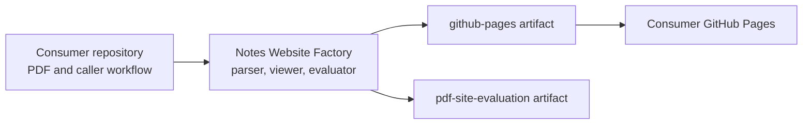

# Constitution

## Product

The repository converts exactly one one-page Apple Freeform PDF into a static, zoomable educational website. Production parsing is Haskell using `pdf-toolbox` and project-owned interpretation, validation, vectorization, and emission.

## Boundaries

- The deployed product contains no PDF, full-page PDF raster, OCR output, browser PDF parser, backend, or runtime production toolchain.
- Poppler and Chromium are development evaluation tools only.
- Unsupported source content fails explicitly.
- Deterministic transformations remain pure; filesystem and process effects stay at module boundaries.
- Output paths must never equal or contain the repository root.
- The generated site preserves source order and distinguishes traced vector artwork from genuinely raster content.

## Quality Contract

`make test` is the compile, unit, integration, and distribution gate. Rendering changes additionally require `make evaluate`, inspection of `build/evaluation/report.html`, and passing 18 and 72 DPI comparisons.

## Amendment 1: Separate Factory and Consumer Ownership

Accepted on 2026-08-23.

The factory is a reusable build system, not a notes website. It owns the Haskell generator, shared viewer, fixed quality policy, synthetic fixture, and reusable artifact-building workflow. Each consumer owns exactly one one-page Apple Freeform PDF, its site title, its caller trigger, and deployment permissions.

The factory emits validated `github-pages` and `pdf-site-evaluation` artifacts but does not deploy them. Consumer input, factory implementation, generated site, and evaluation evidence use separate filesystem roots. Removable paths cannot overlap those roots or use symlink targets or unresolved symlink parents. The production-content PDF formerly stored here is owned by its consumer repository.

## Amendment 2: Build-Time Topic Recognition

Accepted on 2026-08-29.

The factory may use Poppler and English-language optical character recognition during the build to label navigation targets enclosed by detected Freeform highlighter frames. This amendment supersedes the OCR and evaluation-only Poppler restrictions in Boundaries only for that topic-index flow. OCR labels are interaction metadata, not reconstructed source content: they appear only in normal-mode controls and never replace, hide, or add text over the PDF-derived board.

The deployed product still contains no source PDF, full-page PDF raster, OCR engine, browser PDF parser, backend, or runtime production toolchain. Temporary topic crops remain outside the site artifact. Unsupported PDF content still fails explicitly, while an empty successful OCR result receives a neutral navigation label without changing the rendered board.

## Amendment 3: Composited Detection and Opaque Highlighters

Accepted on 2026-08-29.

The topic-index build may create a temporary low-resolution full-page render because a visible Freeform frame can span multiple image XObjects. The render exists only in removable build space, supplies geometry rather than OCR text, and never enters the deployed product. OCR remains restricted to bounded interiors of accepted frames.

The generated board may render a positively identified Freeform highlighter stroke at full opacity. This exception changes opacity only: it cannot add text, geometry, or pixels outside the source stroke. Other low-alpha content retains source alpha under the existing fidelity contract.

## Amendment 4: Remove Topic Recognition

Accepted on 2026-09-16.

The factory must not detect highlighter frames, render topic crops, run optical character recognition, emit topic metadata, or provide topic navigation controls. Amendment 2 is superseded. The topic-recognition portion of Amendment 3 is superseded; its opaque-highlighter rendering exception remains in force.
